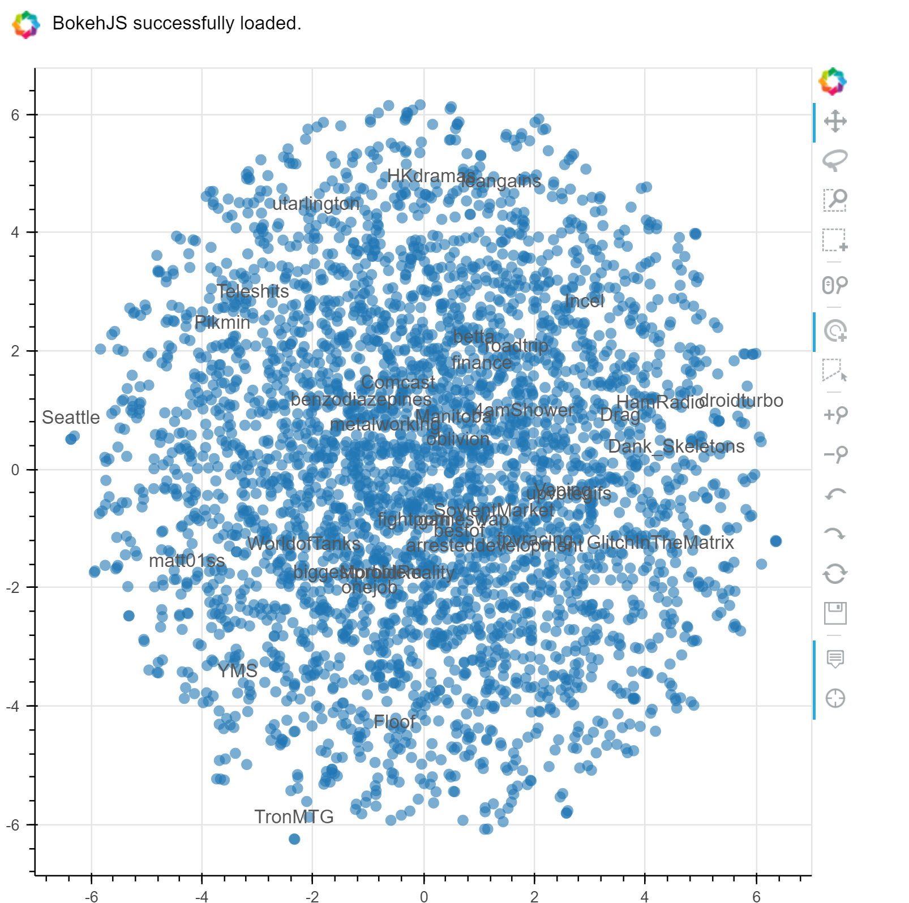

<h2>Introduction</h2>
As part of a project course in my second semester, we were tasked with building a system of our chosing that encorporated or showcased any of the Computational Intelligence techniques we learned about in class. For our project, we decided to investigate the application of Recurrent Nueral Networks to the task of building a Subreddit recommender system for Reddit users. In this post, I outline some of the implementation details of the final system. A minimal webapp for the final model can be interacted with [here,](http://ponderinghydrogen.pythonanywhere.com/) The final research paper for the project can be found [here](http://cole-maclean.github.io/blog/files/subreddit-recommender.pdf) and my collaboraters on the project are Barbara Garza and Suren Oganesian. The github repo for the project can be found [here](https://github.com/cole-maclean/MAI-CI) with this jupyter notebook being [here.](https://github.com/cole-maclean/MAI-CI/blob/master/notebooks/blog%20post.ipynb)


<h3>Model Hypothesis</h3>

The goal of the project is to utilize the sequence prediction power of RNN's to predict possibly interesting subreddits to a user based on their comment history. The hypothesis of the recommender model is, given an ordered sequence of user subreddit interactions, patterns will emerge that favour the discovery of paticular new subreddits given that historical user interaction sequence. Intuitively speaking, as users interact with the Reddit ecosystem, they discover new subreddits of interest, but these new discoveries are influenced by the communities they have previously been interacting with. We can then train a model to recognize these emergent subreddit discoveries based on users historical subreddit discovery patterns. When the model is presented with a new sequence of user interaction, it "remembers" other users that historically had similiar interaction habits and recommends their subreddits that the current user has yet to discover.  
 
This sequential view of user interaction/subreddit discovery is similiar in structure to other problems being solved with the use of Recurrent Neural Networks, such as [Character Level Language Modelling](http://karpathy.github.io/2015/05/21/rnn-effectiveness/) and [Automatic Authorship Detection](http://r2rt.com/recurrent-neural-networks-in-tensorflow-iii-variable-length-sequences.html). Due to the successes of these similiarly structured problems, we have decided to explore RNN models for the subbreddit Recommendator System.

<h3>The Data</h3>
The secret sauce in any machine learning system, we need data. Reddit provides a convenient API for scrapping its public facing data, and the python package [PRAW](https://praw.readthedocs.io/en/latest/) is a popular and well documented wrapper that we used in this project. With the aim of developing sequences of user subreddit interactions, all we need for our raw data is a list of 3-tuples in the form [username,subreddit,utc timestamp]. The following script provides a helper function to collect and store random user comment data from Reddit's streaming 'all' comments. Note that PRAW authentication config data needs to be stored in a file named 'secret.ini' with:  
[reddit]  
api_key: key  
client_id: id  
client_api_key: client key  
redirect_url: redir url  
user_agent: subreddit-recommender by /u/upcmaici v 0.0.1  


```python
import praw
import configparser
import random
import pandas as pd
import numpy as np
import sys

#Import configuration parameters, user agent for PRAW Reddit object
config = configparser.ConfigParser()
config.read('secrets.ini')

#load user agent string
reddit_user_agent = config.get('reddit', 'user_agent')
client_id = config.get('reddit', 'client_id')
client_secret = config.get('reddit', 'client_api_key')

#main data scrapping script
def scrape_data(n_scrape_loops = 10):
    reddit_data = []
    #initialize the praw Reddit object
    r = praw.Reddit(user_agent=reddit_user_agent,client_id = client_id,client_secret=client_secret) 
    for scrape_loop in range(n_scrape_loops):
        try:
            all_comments = r.get_comments('all')
            print ("Scrape Loop " + str(scrape_loop))
            for cmt in all_comments:
                user = cmt.author        
                if user:
                    for user_comment in user.get_comments(limit=None):
                        reddit_data.append([user.name,user_comment.subreddit.display_name,
                                      user_comment.created_utc])
        except Exception as e:
            print(e)
    return reddit_data
```


```python
raw_data = scrape_data(10)
```

    Version 3.5.0 of praw is outdated. Version 4.3.0 was released Thursday January 19, 2017.
    Scrape Loop 0
    Scrape Loop 1
    Scrape Loop 2
    Scrape Loop 3
    Scrape Loop 4
    Scrape Loop 5
    Scrape Loop 6
    Scrape Loop 7
    Scrape Loop 8
    Scrape Loop 9
    


```python
print("Collected " + str(len(raw_data)) + " comments")
raw_data[0:10]
```

    Collected 158914 comments
    


    [['Illuminate1738', 'MapPorn', 1486680909.0],
     ['Illuminate1738', 'MapPorn', 1486471452.0],
     ['Illuminate1738', 'nova', 1486228887.0],
     ['Illuminate1738', 'nova', 1485554669.0],
     ['Illuminate1738', 'nova', 1485549461.0],
     ['Illuminate1738', 'MapPorn', 1485297397.0],
     ['Illuminate1738', 'ShitRedditSays', 1485261592.0],
     ['Illuminate1738', 'ShittyMapPorn', 1483836164.0],
     ['Illuminate1738', 'MapPorn', 1483798990.0],
     ['Illuminate1738', 'MapPorn', 1483503268.0]]


<h2>Data Munging</h2>
We need to parse the raw data into a structure consumpable by a supervised learning algorithm like RNN's. First we build a model vocabulary and ditribution of subreddit popularity from the collect raw data. We use this to build the training dataset, the subreddit interaction sequence for each user, ordered and then split into chunks representing different periods of Reddit interaction and discovery. From each chunk, we can randomly remove a single subreddit from the interaction as the "discovered" subreddit and use it as our training label for the interaction sequences. This formulation brings with it a hyperparameter that will require tuning, namely the sequence size of each chunk of user interaction periods. The proposed model utilizes the distribution of subreddits existing in the dataset to weight the random selection of a subreddit as the sequence label, which gives a higher probability of selection to rarer subreddits. This will smoothen the distribution of training labels across the models vocabulary of subreddits in the dataset. Also, each users interaction sequence has been compressed to only represent the sequence of non-repeating subreddits, to eliminate the repeatative structure of users constantly commenting in a single subreddit, while providing information of the users habits in the reddit ecosystem more generally, allowing the model to distinguish broader patterns from the compressed sequences.


```python
def chunks(l, n):
    n = max(1, n)
    return (l[i:i+n] for i in range(0, len(l), n))

def normalize(lst):
    s = sum(lst)
    normed = [itm/s for itm in lst]
    normed[-1] = (normed[-1] + (1-sum(normed)))#pad last value with what ever difference neeeded to make sum to exactly 1
    return normed
```


```python
"""This routine develops the models vocabulary and vocab_probs is also built, representing the inverse probability 
of encounting a paticular subreddit in the given dataset, which is then used to bias the selection of rarer
subreddits as labels to 
smooth the distribution of training labels across all subreddits in the vocabulary"""

df = pd.DataFrame(raw_data,columns=['user','subreddit','utc_stamp'])
train_data = None#free up train_data memory
vocab_counts = df["subreddit"].value_counts()
tmp_vocab = list(vocab_counts.keys())
total_counts = sum(vocab_counts.values)
inv_prob = [total_counts/vocab_counts[sub] for sub in tmp_vocab]
vocab = ["Unseen-Sub"] + tmp_vocab #build place holder, Unseen-Sub, for all subs not in vocab
tmp_vocab_probs = normalize(inv_prob)
#force probs sum to 1 by adding differenc to "Unseen-sub" probability
vocab_probs = [1-sum(tmp_vocab_probs)] + tmp_vocab_probs
print("Vocab size = " + str(len(vocab)))
```

    Vocab size = 3546
    


```python
sequence_chunk_size = 15
def remove_repeating_subs(raw_data):
    cache_data = {}
    prev_usr = None
    past_sub = None
    for comment_data in raw_data:
        current_usr = comment_data[0]
        if current_usr != prev_usr:#New user found in sorted comment data, begin sequence extraction for new user
            if prev_usr != None and prev_usr not in cache_data.keys():#dump sequences to cache for previous user if not in cache
                cache_data[prev_usr] = usr_sub_seq
            usr_sub_seq = [comment_data[1]] #initialize user sub sequence list with first sub for current user
            past_sub = comment_data[1]
        else:#if still iterating through the same user, add new sub to sequence if not a repeat
            if comment_data[1] != past_sub:#Check that next sub comment is not a repeat of the last interacted with sub,
                                            #filtering out repeated interactions
                usr_sub_seq.append(comment_data[1])
                past_sub = comment_data[1]
        prev_usr = current_usr #update previous user to being the current one before looping to next comment
    return cache_data

def build_training_sequences(usr_data):
    train_seqs = []
    #split user sub sequences into provided chunks of size sequence_chunk_size
    for usr,usr_sub_seq in usr_data.items():
        comment_chunks = chunks(usr_sub_seq,sequence_chunk_size)
        for chnk in comment_chunks:
            #for each chunk, filter out potential labels to select as training label, filter by the top subs filter list
            filtered_subs = [vocab.index(sub) for sub in chnk]
            if filtered_subs:
                #randomly select the label from filtered subs, using the vocab probability distribution to smooth out
                #representation of subreddit labels
                filter_probs = normalize([vocab_probs[sub_indx] for sub_indx in filtered_subs])
                label = np.random.choice(filtered_subs,1,p=filter_probs)[0]
                #build sequence by ensuring users sub exists in models vocabulary and filtering out the selected
                #label for this subreddit sequence
                chnk_seq = [vocab.index(sub) for sub in chnk if sub in vocab and vocab.index(sub) != label] 
                train_seqs.append([chnk_seq,label,len(chnk_seq)]) 
    return train_seqs
```

We transform the munged-data into a pandas dataframe for easier manipulation. Note that the subreddits have been integer encoded, indexed by their order in the vocabulary.


```python
pp_user_data = remove_repeating_subs(raw_data)
train_data = build_training_sequences(pp_user_data)
seqs,lbls,lngths = zip(*train_data)
train_df = pd.DataFrame({'sub_seqs':seqs,
                         'sub_label':lbls,
                         'seq_length':lngths})
train_df.head()
```


<div>
<table border="1" class="dataframe">
  <thead>
    <tr style="text-align: right;">
      <th></th>
      <th>seq_length</th>
      <th>sub_label</th>
      <th>sub_seqs</th>
    </tr>
  </thead>
  <tbody>
    <tr>
      <th>0</th>
      <td>13</td>
      <td>432</td>
      <td>[46, 157, 46, 483, 157, 46, 157, 856, 157, 856...</td>
    </tr>
    <tr>
      <th>1</th>
      <td>9</td>
      <td>46</td>
      <td>[157, 432, 157, 432, 157, 432, 157, 157, 157]</td>
    </tr>
    <tr>
      <th>2</th>
      <td>7</td>
      <td>46</td>
      <td>[432, 432, 432, 432, 856, 856, 157]</td>
    </tr>
    <tr>
      <th>3</th>
      <td>13</td>
      <td>432</td>
      <td>[46, 157, 46, 157, 46, 157, 856, 157, 46, 157,...</td>
    </tr>
    <tr>
      <th>4</th>
      <td>13</td>
      <td>1048</td>
      <td>[46, 157, 46, 157, 46, 157, 46, 157, 46, 157, ...</td>
    </tr>
  </tbody>
</table>
</div>


<h3>Tensorflow Model Architecture</h3>

Originally, we built the model directly on-top of tensorflow, using the fantastic tutorials from [R2RT](http://r2rt.com/) as reference. However, building and managing various nueral network architectures with Tensorflow can be cumbersome, and higher level wrapper packages exist to abstract away some of the more tedious variable and graph definition steps required for tensorflow models. We chose the [tflearn](http://tflearn.org/) python package, which has an API similiar to sklearn, which the team had more experience with. With tflearn, it's rather easy to plug and play with different layers, and we experimented with LSTM, GRU and multi-layered Bi-Directional RNN architectures.


```python
import tensorflow as tf
import tflearn
from tflearn.data_utils import to_categorical, pad_sequences
import numpy as np

def train_model(train,test,vocab_size,n_epoch=2,n_units=128,dropout=0.6,learning_rate=0.0001):

    trainX = train['sub_seqs']
    trainY = train['sub_label']
    testX =  test['sub_seqs']
    testY =  test['sub_label']

    # Sequence padding
    trainX = pad_sequences(trainX, maxlen=sequence_chunk_size, value=0.,padding='post')
    testX = pad_sequences(testX, maxlen=sequence_chunk_size, value=0.,padding='post')

    # Converting labels to binary vectors
    trainY = to_categorical(trainY, nb_classes=vocab_size)
    testY = to_categorical(testY, nb_classes=vocab_size)

    # Network building
    net = tflearn.input_data([None, 15])
    net = tflearn.embedding(net, input_dim=vocab_size, output_dim=128,trainable=True)
    net = tflearn.gru(net, n_units=n_units, dropout=dropout,weights_init=tflearn.initializations.xavier(),return_seq=False)
    net = tflearn.fully_connected(net, vocab_size, activation='softmax',weights_init=tflearn.initializations.xavier())
    net = tflearn.regression(net, optimizer='adam', learning_rate=learning_rate,
                             loss='categorical_crossentropy')

    # Training
    model = tflearn.DNN(net, tensorboard_verbose=2)

    model.fit(trainX, trainY, validation_set=(testX, testY), show_metric=False,
              batch_size=256,n_epoch=n_epoch)
    
    return model
```

    c:\python35\lib\site-packages\tensorflow\python\util\deprecation.py:155: DeprecationWarning: inspect.getargspec() is deprecated, use inspect.signature() instead
      arg_spec = inspect.getargspec(func)
    c:\python35\lib\site-packages\tensorflow\python\util\deprecation.py:155: DeprecationWarning: inspect.getargspec() is deprecated, use inspect.signature() instead
      arg_spec = inspect.getargspec(func)
    c:\python35\lib\site-packages\tensorflow\contrib\labeled_tensor\python\ops\_typecheck.py:233: DeprecationWarning: inspect.getargspec() is deprecated, use inspect.signature() instead
      spec = inspect.getargspec(f)
    

<h2>Model Training</h2>
We split the model into train/test sets and begin training. Here we use the default training parameters, but the model can be tuned for epochs, internal units, dropout, learning-rate and other hyperparameters of the chosen RNN structure.


```python
split_perc=0.8
train_len, test_len = np.floor(len(train_df)*split_perc), np.floor(len(train_df)*(1-split_perc))
train, test = train_df.ix[:train_len-1], train_df.ix[train_len:train_len + test_len]
model = train_model(train,test,len(vocab))
```

    Training Step: 29  | total loss: 8.17396 | time: 1.104s
    | Adam | epoch: 002 | loss: 8.17396 -- iter: 3584/3775
    Training Step: 30  | total loss: 8.17391 | time: 2.222s
    | Adam | epoch: 002 | loss: 8.17391 | val_loss: 8.17437 -- iter: 3775/3775
    --
    

It can be difficult to tell how well the model is performing simply by staring at the flipping numbers above, but tensorflow provides a visualization tool called [tensorboard](https://www.tensorflow.org/how_tos/summaries_and_tensorboard/) and tflearn has different prebuilt dashboards which can be changed using the tensorboard_verbose option of the DNN layer.  


<h2>Visualizng the Model</h2>
As part of the model, a high dimension embedding space is learnt representing the subreddits in the vocabulary as vectors that can be reasoned about with "distance" from each other in the embedding space, and visualized with dimensionality reduction techniques, similiar to the concepts used in [word2vec.](http://www.deeplearningweekly.com/blog/demystifying-word2vec) The tutorial by Arthur Juliani [here](https://medium.com/@awjuliani/visualizing-deep-learning-with-t-sne-tutorial-and-video-e7c59ee4080c#.xdlzpd34w) was used to build the embedding visualization.


```python
from sklearn.manifold import TSNE
#retrieve the embedding layer fro mthe model by default name 'Embedding'
embedding = tflearn.get_layer_variables_by_name("Embedding")[0]
finalWs = model.get_weights(embedding)
tsne = TSNE(perplexity=30, n_components=2, init='pca', n_iter=5000)
lowDWeights = tsne.fit_transform(finalWs)
```


```python
from bokeh.plotting import figure, show, output_notebook,output_file
from bokeh.models import ColumnDataSource, LabelSet

#control the number of labelled subreddits to display
sparse_labels = [lbl if random.random() <=0.01 else '' for lbl in vocab]
source = ColumnDataSource({'x':lowDWeights[:,0],'y':lowDWeights[:,1],'labels':sparse_labels})


TOOLS="hover,crosshair,pan,wheel_zoom,zoom_in,zoom_out,box_zoom,undo,redo,reset,tap,save,box_select,poly_select,lasso_select,"

p = figure(tools=TOOLS)

p.scatter("x", "y", radius=0.1, fill_alpha=0.6,
          line_color=None,source=source)

labels = LabelSet(x="x", y="y", text="labels", y_offset=8,
                  text_font_size="10pt", text_color="#555555", text_align='center',
                 source=source)
p.add_layout(labels)

#output_file("embedding.html")
output_notebook()
show(p)
```




<h2>Saving the Model</h2>
To save the model for use in making real-world predictions, potentially as part of a webapp, we need to freeze the tensorflow graph and transform the variables into constants to maintain the final network. The tutorial [here](https://blog.metaflow.fr/tensorflow-how-to-freeze-a-model-and-serve-it-with-a-python-api-d4f3596b3adc#.eopkd8pys) walks us through how to accomplish this.


```python
from tensorflow.python.framework import graph_util
def freeze_graph(model):
    # We precise the file fullname of our freezed graph
    output_graph = "/tmp/frozen_model.pb"

    # Before exporting our graph, we need to precise what is our output node
    # This is how TF decides what part of the Graph he has to keep and what part it can dump
    # NOTE: this variable is plural, because you can have multiple output nodes
    output_node_names = "InputData/X,FullyConnected/Softmax"

    # We clear devices to allow TensorFlow to control on which device it will load operations
    clear_devices = True
    
    # We import the meta graph and retrieve a Saver
    #saver = tf.train.import_meta_graph(input_checkpoint + '.meta', clear_devices=clear_devices)

    # We retrieve the protobuf graph definition
    graph = model.net.graph
    input_graph_def = graph.as_graph_def()

    # We start a session and restore the graph weights
    # We use a built-in TF helper to export variables to constants
    sess = model.session
    output_graph_def = graph_util.convert_variables_to_constants(
        sess, # The session is used to retrieve the weights
        input_graph_def, # The graph_def is used to retrieve the nodes 
        output_node_names.split(",") # The output node names are used to select the usefull nodes
    ) 

    # Finally we serialize and dump the output graph to the filesystem
    with tf.gfile.GFile(output_graph, "wb") as f:
        f.write(output_graph_def.SerializeToString())
    print("%d ops in the final graph." % len(output_graph_def.node))
```


```python
freeze_graph(model)
```

    INFO:tensorflow:Froze 152 variables.
    Converted 8 variables to const ops.
    607 ops in the final graph.
    


```python
def load_graph(frozen_graph_filename):
    # We load the protobuf file from the disk and parse it to retrieve the 
    # unserialized graph_def
    with tf.gfile.GFile(frozen_graph_filename, "rb") as f:
        graph_def = tf.GraphDef()
        graph_def.ParseFromString(f.read())

    # Then, we can use again a convenient built-in function to import a graph_def into the 
    # current default Graph
    with tf.Graph().as_default() as graph:
        tf.import_graph_def(
            graph_def, 
            input_map=None, 
            return_elements=None, 
            name="prefix", 
            op_dict=None, 
            producer_op_list=None
        )
    return graph
```


```python
grph = load_graph("/tmp/frozen_model.pb")
```


```python
x = grph.get_tensor_by_name('prefix/InputData/X:0')
y = grph.get_tensor_by_name("prefix/FullyConnected/Softmax:0")

# We launch a Session
with tf.Session(graph=grph) as sess:
    # Note: we didn't initialize/restore anything, everything is stored in the graph_def
    y_out = sess.run(y, feed_dict={
        x: [[1]*sequence_chunk_size] 
    })
    print(y_out) # [[ False ]] Yay, it works!
```

    [[ 0.00028193  0.00028239  0.00028253 ...,  0.00028406  0.00028214
       0.00028208]]
    

<h2>Final Recommender</h2>
Using the frozen model, we can predict the most likely subreddits to be of interest to a user by collecting Reddit data for a specific user and provide final recommendations based on the most common subreddits with the highest probabilities from the RNN predictions for each of the subreddit sequence chunks of the user.


```python
from collections import Counter
def collect_user_data(user):
    #Import configuration parameters, user agent for PRAW Reddit object
    config = configparser.ConfigParser()
    config.read('secrets.ini')

    #load user agent string
    reddit_user_agent = config.get('reddit', 'user_agent')
    client_id = config.get('reddit', 'client_id')
    client_secret = config.get('reddit', 'client_api_key')
    #initialize the praw Reddit object
    r = praw.Reddit(user_agent=reddit_user_agent,client_id = client_id,client_secret=client_secret) 
    praw_user = r.get_redditor(user)
    user_data = [(user_comment.subreddit.display_name,
                  user_comment.created_utc) for user_comment in praw_user.get_comments(limit=None)]
    return sorted(user_data,key=lambda x: x[1]) #sort by ascending utc timestamp

def user_recs(user,n_recs=10,chunk_size=sequence_chunk_size):
    user_data = collect_user_data(user)
    user_sub_seq = [vocab.index(data[0]) if data[0] in vocab else 0 for data in user_data]
    non_repeating_subs = []
    for i,sub in enumerate(user_sub_seq):
        if i == 0:
            non_repeating_subs.append(sub)
        elif sub != user_sub_seq[i-1]:
            non_repeating_subs.append(sub)
    user_subs = set([vocab[sub_index] for sub_index in non_repeating_subs])
    sub_chunks = list(chunks(non_repeating_subs,chunk_size))
    user_input = pad_sequences(sub_chunks, maxlen=chunk_size, value=0.,padding='post')
    x = grph.get_tensor_by_name('prefix/InputData/X:0')
    y = grph.get_tensor_by_name("prefix/FullyConnected/Softmax:0")
    with tf.Session(graph=grph) as sess:
        sub_probs = sess.run(y, feed_dict={
            x: user_input
        })
    #select the subreddit with highest prediction prob for each of the input subreddit sequences of the user
    recs = [np.argmax(probs) for probs in sub_probs]
    filtered_recs = [filt_rec for filt_rec in recs if filt_rec not in user_sub_seq]
    top_x_recs,cnt = zip(*Counter(filtered_recs).most_common(n_recs))
    sub_recs = [vocab[sub_index] for sub_index in top_x_recs]
    return sub_recs
```


```python
user_recs("ponderinghydrogen")
```


    ['fantasyfootball', 'PS3']


<h2>The Web App</h2>
Those are all the pieces required to build a functioning subreddit recommender system that users can try! Using Flask, a simple web app can be made taking as input any valid reddit user name and outputting recommendations for that user. A minimal web app doing just that can be interacted with [here](http://ponderinghydrogen.pythonanywhere.com/)


<h2>Final Thoughts</h2>
The model being served in the above webapp is an under-tuned and under-dataed proof-of-concept single layer RNN, but it is still  surprisingly capable of suggesting interesting subreddits to some testers I've had use the app. Nueral Networks really are powerful methods for tackling difficult problems, and with better and better Machine Learning research and tooling being released daily, and increasingly powerful computers, the pool of potential problems solvable by a group of determined engineers keeps getting larger. I'm looking forward to tackling the next one.
